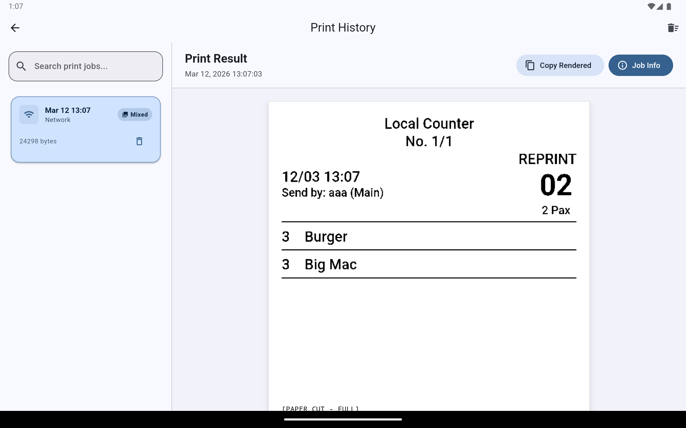
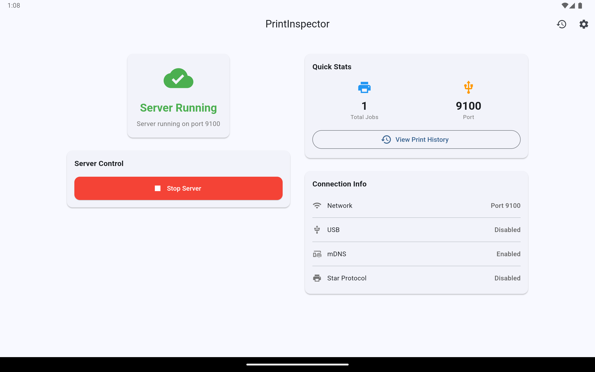

# PrintInspector

PrintInspector is a mobile virtual POS / label printer emulator built with **Flutter**, designed for developers. It captures printer commands (ESC/POS and Star protocols) and renders the resulting receipt or label layout directly on the screen — without requiring a physical printer.

The emulator can simulate common printer interfaces such as TCP port 9100 (network printing) and USB, allowing POS systems to send print jobs exactly as they would to a real printer.

This makes PrintInspector ideal for development, testing, and diagnosing printing issues.

## ✨ Features

🖨 **Virtual POS / label printer emulator**
📜 **ESC/POS protocol support**
⭐ **Star printer protocol support**
🌐 **TCP 9100 raw socket printer simulation**
🔌 **USB printer simulation**
👀 **Real-time receipt / label rendering**
🔍 **Print job inspection & raw hex byte output**
🧪 **Designed for development & QA testing**
📱 **Runs on Android and iOS**

### Supported receipt elements:
* text formatting
* alignment
* images
* barcode
* QR code
* line spacing
* paper cut commands

## 🔌 Supported Printer Interfaces

PrintInspector can simulate multiple common POS printer connection types:

| Interface | Description |
| :--- | :--- |
| **TCP 9100** | Raw network socket printing used by most Ethernet/WiFi receipt printers |
| **USB** | Simulated USB printer endpoint for mobile POS integration |

This allows existing POS systems to send print jobs to PrintInspector without changing their printing logic.

Example TCP printing target:
`tcp://<device-ip>:9100`

Your POS application can print to PrintInspector exactly as it would to a physical printer.

## 📸 Sample Screenshots

<p align="center">
  
  
</p>


**Repo structure:**
```text
lib/
  ├── models/    # Data models (PrintJob, etc.)
  ├── parser/    # ESC/POS & Star protocol parsing logic
  ├── screens/   # UI Screens (Home, History, Settings)
  ├── services/  # Business logic (TCP Server, USB, Database)
  └── utils/     # Constants and theme configuration
test/            # Unit tests for protocol parsing
```

## 🚀 Use Cases

PrintInspector is useful for:
* POS system development
* printer integration testing
* receipt layout debugging
* diagnosing ESC/POS formatting issues
* QA automation for printer output
* testing network printer workflows

## 🧠 Concept

Think of PrintInspector as **a debugging and inspection tool for POS printer output**.

Instead of sending commands blindly to hardware, developers can capture, inspect, and visualize print jobs in real time.

## 📦 Typical Workflow

1. Start PrintInspector
2. Configure your POS system to print to TCP 9100 or USB
3. PrintInspector captures the raw commands
4. The commands are parsed
5. The receipt/label is rendered visually
6. Developers inspect and debug the output

## 📜 License

This project is licensed under the **GNU General Public License v3.0 (GPL-3.0)**.

You are free to use, modify, and distribute this software under the terms of the GPL license. See the [LICENSE](LICENSE) file for full details.